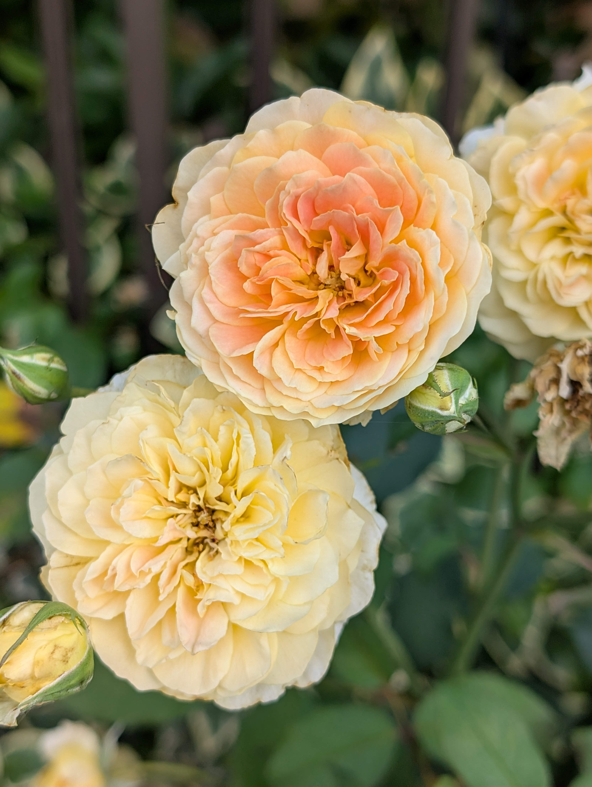
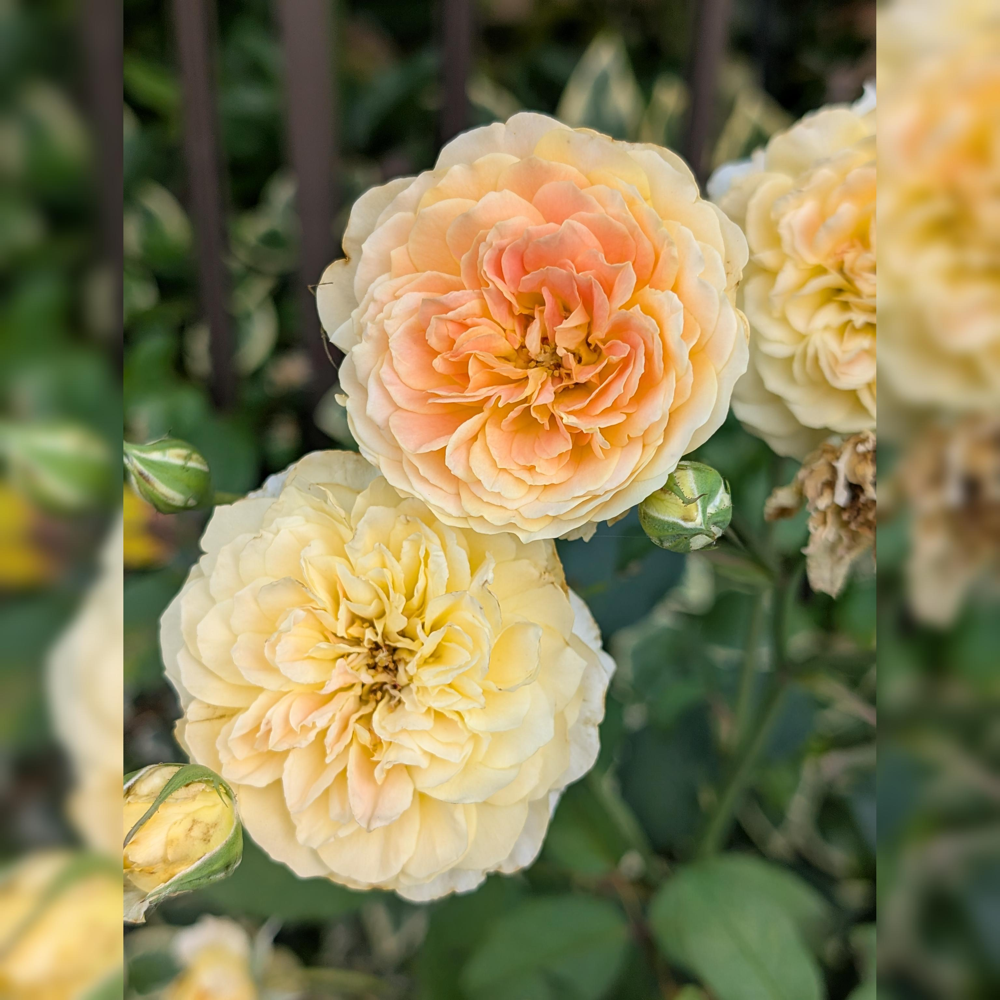

# Instagram風画像加工ツール

Instagram投稿用に画像を簡単に加工したくて作ったツールです。  
ドラッグアンドドロップで画像を落とすだけで、リサイズ＋余白ぼかし埋めが一括で完了！

## 主な機能
- tkinterdnd2でドラッグアンドドロップ対応（複数画像OK）
- Pillowでインスタ推奨の比率にリサイズ
- 余白はぼかしで自然に埋める（シンプル加工）\
   → 
- 元画像も加工後フォルダに移動
- ボタン：加工後フォルダ(`output`)を開く / Instagram投稿用タグをクリップボードにコピー(`insta_tag.txt`で編集可能)
- 超簡素GUI（ドロップエリア＋ボタンだけ）\
  

## 使い方
1. `insta_processor.py` を実行
2. 画像ファイルをウィンドウにドラッグアンドドロップ
3. 加工完了後、フォルダ表示 / タグコピーで投稿準備完了！

## 使った技術
- Python (tkinter, tkinterdnd2, Pillow)
- 画像処理（リサイズ、ぼかし）
- ドラッグアンドドロップで複数ファイル対応

## 今後の予定（やりたいこと）
- アスペクト比選択（1:1 / 4:5 など）
- ぼかし強度スライダー実装

動けばヨシ！精神で作りました。  
Instagram投稿が少しでも楽しくなればいいなと思ってます。

ご覧いただきありがとうございます！
